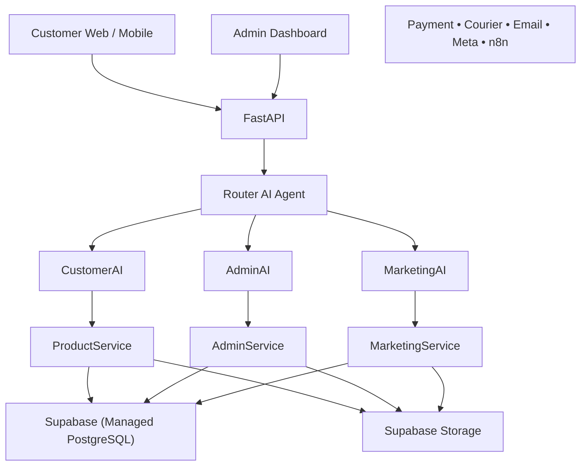

# Component Diagrams

---

Document ID: SAD-004

Title: Component Diagrams

Version: 1.0

Status: Approved

Owner: Aura Skincare

Category: Software Architecture

Last Updated: 2026-09-15

---

# Purpose

This document defines the major software components of the Aura platform and the relationships between them.

---

# High-Level Component Diagram

---

# Major Components

## Client Layer

- Customer Website
- Future Mobile App
- Admin Dashboard

---

## API Layer

- FastAPI
- REST API
- Authentication
- Request Validation

---

## AI Layer

- Router Agent
- Customer AI Agent
- Admin AI Agent
- Marketing AI Agent
- Development AI Agent

---

## Business Layer

- Product Service
- Customer Service
- Order Service
- Inventory Service
- Analytics Service

---

## Integration Layer

- Payment Gateway
- Courier API
- Email
- WhatsApp
- Messenger
- Instagram
- n8n

---

## Data Layer

- Supabase (Managed PostgreSQL)
- Supabase Storage

---

# Component Communication Rules

- Components communicate through service interfaces.
- No direct database access from UI.
- AI Agents never bypass Business Services.
- External services are accessed only through the Integration Layer.

---

# Core Principle

Every component has a single responsibility and communicates only through defined interfaces.