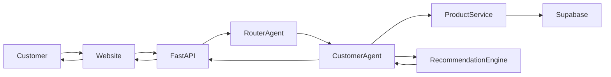
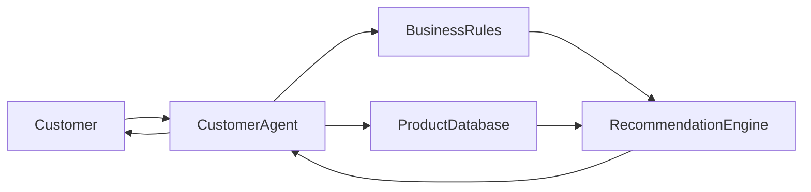
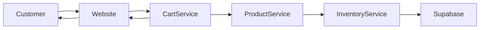
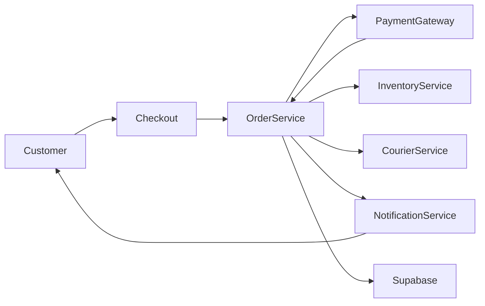
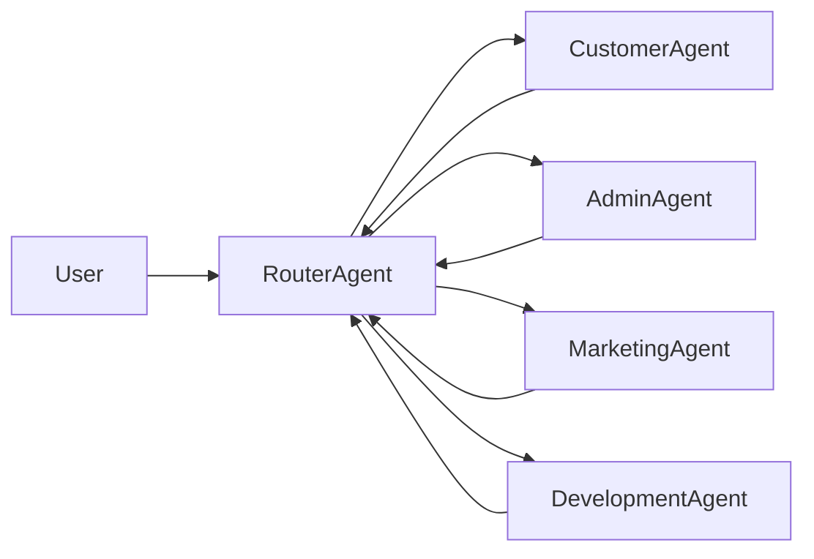
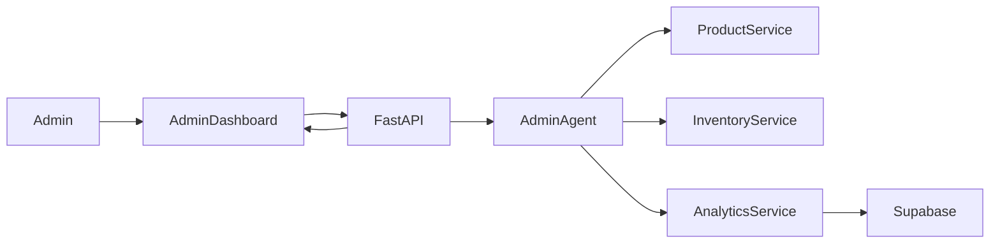
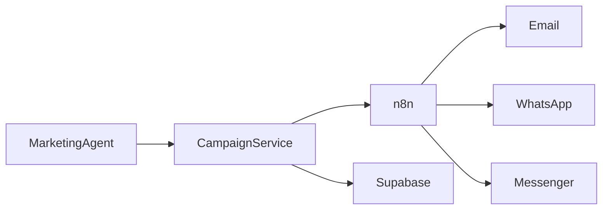
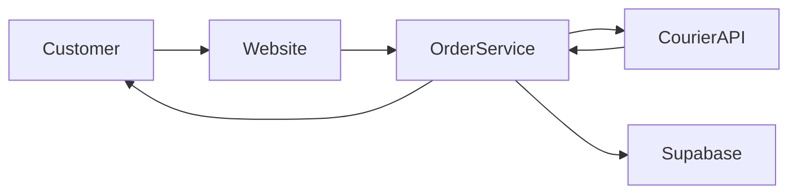

# Data Flow Diagrams

---

Document ID: SAD-003

Title: Data Flow Diagrams

Version: 1.0

Status: Approved

Owner: Aura Skincare

Category: Software Architecture

Last Updated: 2026-09-15

---

# Purpose

This document defines the official data flow across the Aura platform.

It illustrates how requests, data, AI agents, business services, and external integrations interact throughout the system.

---

# DFD-001 — Customer AI Consultation

---

# DFD-002 — Product Recommendation Flow

---

# DFD-003 — Shopping Cart Flow

---

# DFD-004 — Checkout and Order Flow

---

# DFD-005 — AI Agent Routing

---

# DFD-006 — Admin Management Flow

---

# DFD-007 — Marketing Automation Flow

---

# DFD-008 — Order Tracking Flow

---

# System Data Flow Summary

Customer Channels

- Website
- Admin Dashboard
- WhatsApp
- Messenger
- Instagram

↓

API Layer

- FastAPI

↓

AI Layer

- Router Agent
- Customer AI Agent
- Admin AI Agent
- Marketing AI Agent
- Development AI Agent

↓

Business Layer

- Product Service
- Customer Service
- Order Service
- Inventory Service
- Analytics Service

↓

Integration Layer

- Payment Gateway
- Courier
- Email
- Meta APIs
- n8n

↓

Data Layer

- Supabase (Managed PostgreSQL)

---

# Design Principles

- Single Source of Truth
- API First
- AI First
- Modular Architecture
- Documentation First
- Stateless API Layer
- Future Microservices Ready

---

# Core Principle

Every request follows a predictable, documented, and traceable path from user interaction to data persistence, ensuring maintainability, scalability, and reliability.