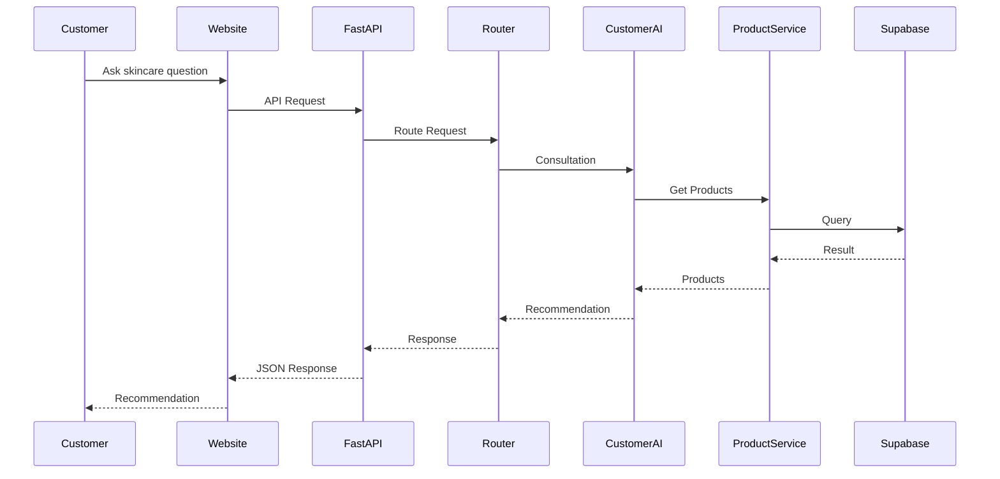
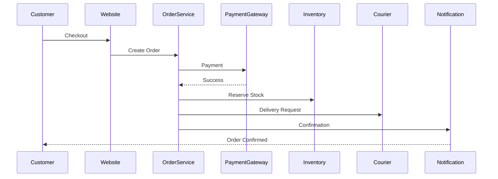

# Sequence Diagrams

---

Document ID: SAD-005

Title: Sequence Diagrams

Version: 1.0

Status: Approved

Owner: Aura Skincare

Category: Software Architecture

Last Updated: 2026-09-15

---

# Customer AI Consultation

---

# Checkout Flow

---

# Core Principle

Every business process follows a predictable, traceable sequence.