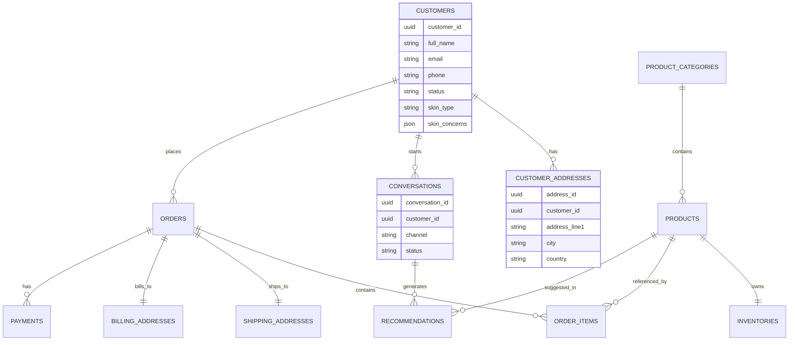

# Entity Relationship Diagram

---

Document ID: DB-002

Title: Entity Relationship Diagram

Version: 1.0

Status: Approved

Owner: Aura Skincare

Category: Database

  Last Updated: 2026-09-17

---

# Purpose

This document defines the logical relationships between all primary database entities.

---

---

# Relationship Rules

- One Customer → Many Orders
- One Customer → Many Conversations
- One Category → Many Products
- One Product → One Inventory
- One Order → Many Order Items
- One Order → One ShippingAddress
- One Order → One BillingAddress
- One Conversation → Many Recommendations

---

# Core Principle

Relationships must enforce data integrity through foreign keys.