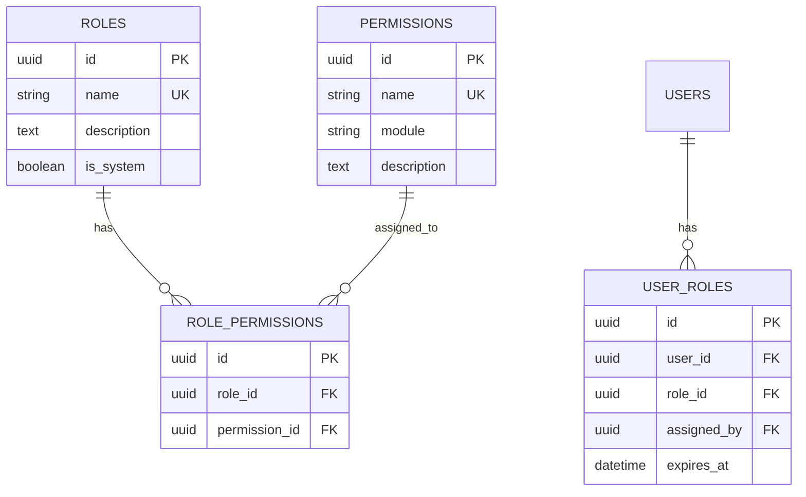
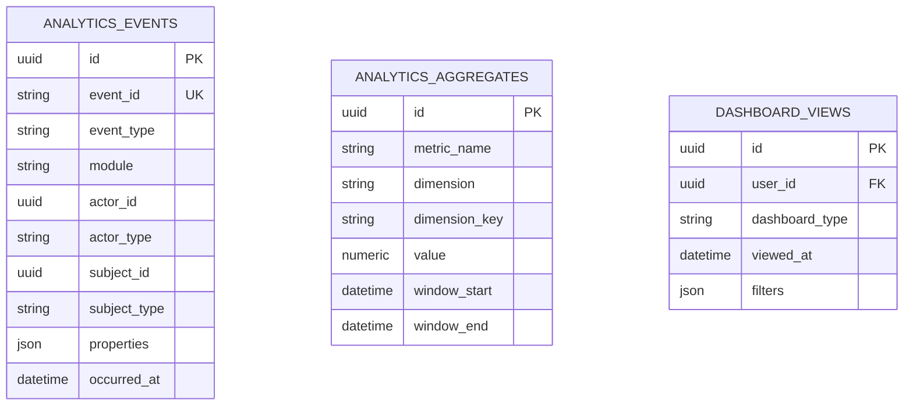
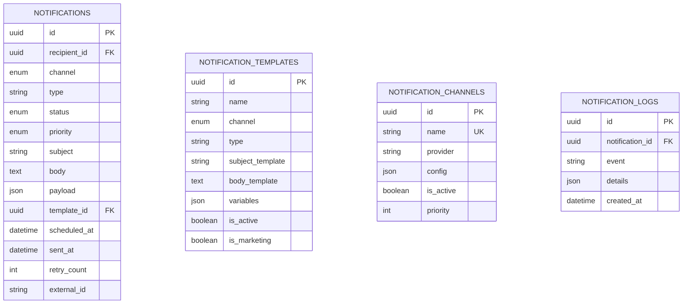

# FOUNDATION-CORE-001

## Design Report: V1 Core Modules (Inventory, Authentication, Authorization, Analytics, Notification)

Document ID: FOUNDATION-CORE-001
Status: Draft
Version: 1.0
Owner: Aura Skincare
Category: Architecture Design
Last Updated: 2026-09-17

---

## 1. Architecture

### 1.1 System Context

Aura is a **Modular Monolith** built on FastAPI, SQLAlchemy, PostgreSQL (Supabase Cloud), Redis, n8n, and LangGraph. Each module is a self-contained package under `backend/app/modules/<module>/` with its own `models/`, `schemas/`, `services/`, `repositories/`, and `routes/` layers.

### 1.2 Module Map (V1)

| Module | Layer | Ownership |
|--------|-------|-----------|
| Customer | Core | Customer data, addresses, conversations |
| Product | Core | Catalog, categories, brands, variants, images |
| Inventory | Core | Stock, warehouses, movements, adjustments, reservations |
| Order | Core | Orders, order items, shipping/billing addresses |
| Payment | Core | Payments, refunds |
| Auth | Core | Users, tokens, MFA, password reset, email verification |
| Authorization | Core | Roles, permissions, policy enforcement |
| Analytics | Read-only | Events, aggregates, dashboards, KPIs |
| Notification | Core | Channels, templates, queue, delivery |
| AI | Core | Router, agents, LangGraph workflows |
| Integration | External | Third-party APIs (email, WhatsApp, Messenger, courier, payment) |
| Admin | Management | Admin tools, user management |

### 1.3 Module Dependency Diagram

```text
Customer
  → Product
  → Order
  → Payment
  → AI

Product
  → Inventory (1:1)

Order
  → Inventory
  → Payment

AI
  → Product
  → Customer
  → Analytics (read-only)

Analytics
  → All modules (read-only)

Notification
  → Integration (sending)
  → Auth (recipient identity)

Authorization
  → Auth (identity)

Inventory
  → Product (read)
  → Order (reservation)
```

### 1.4 Forbidden Dependencies

- Product → Order
- Database → Business / API
- UI → Database
- AI → Database
- Integration → UI
- Any module → Auth write operations (except Auth itself)
- Analytics → Write operations on business tables

---

## 2. Cross-Module Review

### 2.1 Module Dependencies

- **Inventory** depends on Product (read catalog) and Order (reserve/release stock).
- **Authentication** is foundational; all modules depend on it for identity.
- **Authorization** depends on Authentication for identity resolution.
- **Analytics** depends on every module for read-only event ingestion.
- **Notification** depends on Integration for delivery and Auth for recipient identity.

### 2.2 Circular Dependency Check

No circular dependencies exist. Dependencies always point inward toward the business domain.

### 2.3 Shared Entities

- `users` table (Auth module) is referenced by all modules for audit fields (`created_by`, `updated_by`) and identity.
- Audit mixins (`created_at`, `updated_at`, `deleted_at`, `created_by`, `updated_by`, `deleted_by`) are shared via `app.shared.database.base`.
- Soft delete strategy applies to all business tables.

### 2.4 Shared Services

- `app.shared.security.jwt` — token creation/decoding.
- `app.shared.security.password` — bcrypt hashing/verification.
- `app.shared.database.session` — async DB session factory.
- `app.shared.events` — internal event bus for cross-module event publishing.
- `app.shared.utils` — common helpers.

### 2.5 Future Compatibility

Module interfaces are designed as internal service contracts. When extracting to microservices, each module's service layer becomes a remote contract without changing business logic.

---

## 3. Module Contracts

### 3.1 Inventory Module

#### Purpose

Manage stock availability, warehouse locations, stock movements, adjustments, reservations, and supplier references to ensure accurate inventory levels and order fulfillment.

#### Responsibilities

- Track real-time stock per product and warehouse.
- Reserve stock for pending orders.
- Record stock movements (purchase, sale, return, transfer).
- Support stock adjustments with audit trail.
- Maintain warehouse locations.
- Link products to suppliers.
- Trigger low-stock alerts (future automation).

#### Scope

- In scope: stock tracking, warehouse management, movement logging, reservations, adjustments, supplier references.
- Out of scope: procurement workflow, shipping logistics, accounting (future modules).

#### Business Rules

- One product has exactly one inventory record per warehouse.
- Stock cannot go below zero without an explicit override (Admin only).
- Reservations reduce available stock but do not reduce physical stock until shipped.
- Adjustments require an authorized actor and a documented reason.
- Movements are immutable once created.
- Deleting a warehouse requires transferring or discarding inventory first.
- Soft delete is used for warehouses and supplier references; inventory records are archived, not deleted.

#### Data Model

**Tables**

- `warehouses`
  - `id` UUID PK
  - `name` VARCHAR(255)
  - `code` VARCHAR(50) unique
  - `location` VARCHAR(255)
  - `is_active` BOOLEAN default true
  - Audit fields

- `inventories`
  - `id` UUID PK
  - `product_id` UUID FK → products.id unique
  - `warehouse_id` UUID FK → warehouses.id
  - `quantity_on_hand` INTEGER default 0
  - `quantity_reserved` INTEGER default 0
  - `quantity_available` INTEGER computed (on_hand - reserved)
  - `low_stock_threshold` INTEGER default 10
  - `is_tracking_enabled` BOOLEAN default true
  - Audit fields
  - Unique constraint: `(product_id, warehouse_id)`

- `inventory_movements`
  - `id` UUID PK
  - `inventory_id` UUID FK → inventories.id
  - `movement_type` ENUM('purchase', 'sale', 'return', 'transfer_in', 'transfer_out', 'adjustment')
  - `quantity` INTEGER (positive for inbound, negative for outbound)
  - `reference_type` VARCHAR(50) (e.g., 'order', 'purchase_order', 'adjustment')
  - `reference_id` UUID nullable
  - `notes` TEXT nullable
  - Audit fields (created_by required)

- `inventory_adjustments`
  - `id` UUID PK
  - `inventory_id` UUID FK → inventories.id
  - `adjustment_type` ENUM('correction', 'damage', 'loss', 'found')
  - `quantity_change` INTEGER
  - `reason` TEXT
  - `approved_by` UUID FK → users.id (nullable until approved)
  - `is_approved` BOOLEAN default false
  - Audit fields

- `inventory_reservations`
  - `id` UUID PK
  - `inventory_id` UUID FK → inventories.id
  - `order_item_id` UUID FK → order_items.id unique
  - `quantity` INTEGER
  - `status` ENUM('reserved', 'released', 'fulfilled', 'cancelled')
  - `expires_at` DATETIME nullable
  - Audit fields

- `suppliers`
  - `id` UUID PK
  - `name` VARCHAR(255)
  - `contact_email` VARCHAR(255)
  - `contact_phone` VARCHAR(50)
  - `lead_time_days` INTEGER
  - `is_active` BOOLEAN default true
  - Audit fields

- `product_suppliers`
  - `id` UUID PK
  - `product_id` UUID FK → products.id
  - `supplier_id` UUID FK → suppliers.id
  - `cost_price` NUMERIC(10,2)
  - `is_preferred` BOOLEAN default false
  - Audit fields
  - Unique constraint: `(product_id, supplier_id)`

#### Relationships

- Warehouse → Inventory (1:N)
- Product → Inventory (1:1)
- Inventory → Movement (1:N)
- Inventory → Adjustment (1:N)
- Inventory → Reservation (1:N)
- Product → Supplier (N:M via product_suppliers)
- OrderItem → Reservation (1:1)

#### API Contract

Base path: `/api/v1/inventory`

| Method | Path | Description | Auth |
|--------|------|-------------|------|
| GET | `/warehouses` | List warehouses | Admin, Manager, Support |
| POST | `/warehouses` | Create warehouse | Admin, Manager |
| GET | `/warehouses/{id}` | Get warehouse | Admin, Manager, Support |
| PATCH | `/warehouses/{id}` | Update warehouse | Admin, Manager |
| DELETE | `/warehouses/{id}` | Soft delete warehouse | Admin |
| GET | `/products/{product_id}` | Get inventory by product | Admin, Manager, Support |
| PATCH | `/products/{product_id}` | Update inventory settings | Admin, Manager |
| POST | `/movements` | Record movement | Admin, Manager, System |
| GET | `/movements` | List movements | Admin, Manager, Support |
| POST | `/adjustments` | Create adjustment request | Admin, Manager |
| POST | `/adjustments/{id}/approve` | Approve adjustment | Admin |
| GET | `/reservations` | List reservations | Admin, Manager, Support |
| POST | `/reservations/{id}/release` | Release reservation | System, Admin |
| GET | `/suppliers` | List suppliers | Admin, Manager, Support |
| POST | `/suppliers` | Create supplier | Admin, Manager |
| PATCH | `/suppliers/{id}` | Update supplier | Admin, Manager |
| DELETE | `/suppliers/{id}` | Soft delete supplier | Admin |
| POST | `/products/{product_id}/suppliers` | Link supplier to product | Admin, Manager |
| DELETE | `/products/{product_id}/suppliers/{supplier_id}` | Unlink supplier | Admin, Manager |

#### Validation Rules

- `quantity_on_hand` >= 0.
- `quantity_reserved` <= `quantity_on_hand`.
- `low_stock_threshold` >= 0.
- `lead_time_days` >= 0.
- `cost_price` >= 0.
- Movement quantity sign must match movement type.
- Reservation quantity must be > 0.
- Adjustment `approved_by` must be set before `is_approved` becomes true.
- Warehouse code must be unique and uppercase.

#### Security Considerations

- Inventory mutations require Admin or Manager role.
- Read access granted to Admin, Manager, Support.
- System processes (order fulfillment) may reserve/release stock using service credentials.
- All mutations logged with user ID.
- Supplier cost data is sensitive; restrict to Admin and Manager.

#### Dependencies

- Product module (read product catalog).
- Order module (create/release reservations).
- Auth module (identity for audit and authorization).
- Integration module (future: supplier API sync).

#### Future AI Usage

- AI predicts low-stock events based on sales velocity.
- AI suggests reorder quantities and suppliers.
- AI detects anomalous movements (theft, data entry error).
- AI automates reservation releases based on order status predictions.

---

### 3.2 Authentication Module

#### Purpose

Provide identity verification, token management, password recovery, email verification, and MFA readiness for all platform actors (customers, admins, AI agents, internal services).

#### Responsibilities

- Register new users.
- Authenticate users with email and password.
- Issue and validate access and refresh tokens.
- Refresh expired access tokens.
- Revoke tokens on logout.
- Initiate and complete password reset flows.
- Verify email addresses.
- Support MFA enrollment and verification (future-ready).
- Manage session lifecycle.

#### Scope

- In scope: registration, login, logout, token refresh, password reset, email verification, MFA readiness.
- Out of scope: SSO (future), social login (future), biometric authentication (future).

#### Business Rules

- Email must be unique across the platform.
- Password must meet minimum complexity requirements (enforced at validation layer).
- Access tokens are short-lived (default: 60 minutes).
- Refresh tokens are long-lived (default: 7 days).
- Password reset tokens are single-use and expire after 15 minutes.
- Email verification links expire after 24 hours.
- MFA is optional for customers, required for Admin and System Administrator roles.
- Account lockout after 5 failed login attempts for 15 minutes.
- Soft delete on user accounts; hard delete requires explicit approval.

#### Data Model

**Tables**

- `users` (exists; extended)
  - `id` UUID PK
  - `email` VARCHAR(255) unique indexed
  - `password_hash` VARCHAR(255)
  - `full_name` VARCHAR(255)
  - `role` ENUM('customer', 'admin', 'marketing', 'support', 'ai_agent', 'system_administrator')
  - `is_active` BOOLEAN default true
  - `is_verified` BOOLEAN default false
  - `last_login_at` DATETIME nullable
  - `failed_login_attempts` INTEGER default 0
  - `locked_until` DATETIME nullable
  - Audit fields

- `refresh_tokens`
  - `id` UUID PK
  - `user_id` UUID FK → users.id
  - `token_jti` VARCHAR(255) unique indexed
  - `expires_at` DATETIME
  - `is_revoked` BOOLEAN default false
  - `created_at` DATETIME default now
  - `revoked_at` DATETIME nullable

- `password_reset_tokens`
  - `id` UUID PK
  - `user_id` UUID FK → users.id
  - `token` VARCHAR(255) unique indexed
  - `expires_at` DATETIME
  - `used_at` DATETIME nullable
  - `created_at` DATETIME default now

- `email_verifications`
  - `id` UUID PK
  - `user_id` UUID FK → users.id
  - `token` VARCHAR(255) unique indexed
  - `expires_at` DATETIME
  - `verified_at` DATETIME nullable
  - `created_at` DATETIME default now

- `mfa_secrets`
  - `id` UUID PK
  - `user_id` UUID FK → users.id unique
  - `secret` VARCHAR(255)
  - `is_enabled` BOOLEAN default false
  - `backup_codes` JSON nullable
  - `created_at` DATETIME default now
  - `updated_at` DATETIME on update

#### Relationships

- User → RefreshToken (1:N)
- User → PasswordResetToken (1:N)
- User → EmailVerification (1:N)
- User → MfaSecret (1:1)

#### API Contract

Base path: `/api/v1/auth`

| Method | Path | Description | Auth |
|--------|------|-------------|------|
| POST | `/register` | Register new user | None |
| POST | `/login` | Login with email and password | None |
| POST | `/refresh` | Refresh access token | Refresh token required |
| POST | `/logout` | Revoke refresh token | Refresh token required |
| POST | `/password-reset/request` | Request password reset | None |
| POST | `/password-reset/confirm` | Confirm password reset | None |
| POST | `/verify-email/request` | Request email verification | None |
| POST | `/verify-email/confirm` | Confirm email verification | None |
| POST | `/mfa/setup` | Setup MFA | Authenticated |
| POST | `/mfa/verify` | Verify MFA code | Authenticated |
| POST | `/mfa/disable` | Disable MFA | Authenticated + MFA |

#### Validation Rules

- Email format validated.
- Password minimum 8 characters, with complexity rules (uppercase, lowercase, number, special character).
- Refresh token JTI must not be revoked.
- Password reset token must not be expired or used.
- Email verification token must not be expired or verified.
- MFA code must be 6 digits and match TOTP.
- Account lockout blocks login until `locked_until` passes.

#### Security Considerations

- Passwords hashed with bcrypt.
- JWT signed with HS256 (or RS256 in future).
- Tokens stored securely (httpOnly cookie recommended for web; secure storage for mobile).
- Tokens never logged.
- Rate limiting on login and password reset endpoints.
- HTTPS required for all endpoints.
- MFA backup codes stored hashed (future).

#### Dependencies

- Shared security utilities (`app.shared.security.jwt`, `app.shared.security.password`).
- Email integration (for verification and password reset emails).
- Future: Integration module for email delivery.

#### Future AI Usage

- AI detects anomalous login patterns (impossible travel, credential stuffing).
- AI recommends MFA enrollment based on risk score.
- AI assists in account recovery flows.

---

### 3.3 Authorization Module

#### Purpose

Enforce access control policies across the platform using Role-Based Access Control (RBAC). Ensure every request is authenticated and explicitly authorized before execution.

#### Responsibilities

- Define roles and permissions.
- Resolve permissions for a given identity.
- Enforce authorization at the API layer.
- Log authorization decisions (allow/deny).
- Support role assignment and permission management (admin).
- Maintain separation of duties.

#### Scope

- In scope: RBAC definition, permission resolution, API-level enforcement, audit logging.
- Out of scope: attribute-based access control (ABAC) (future), resource-level permissions beyond module scope (future).

#### Business Rules

- Every request requires successful authentication.
- Permissions are evaluated before execution.
- Access is denied unless explicitly granted (deny by default).
- Admin role has all permissions.
- System Administrator role has platform-level permissions (infrastructure, security config).
- AI Agents have only approved API access; no direct database access.
- Marketing cannot access customer payment information.
- Support cannot modify system configuration.
- Role changes take effect immediately; existing sessions are not invalidated unless explicitly revoked.

#### Data Model

**Tables**

- `roles` (optional; currently enum on users table; future-proofed)
  - `id` UUID PK
  - `name` VARCHAR(50) unique
  - `description` TEXT nullable
  - `is_system` BOOLEAN default false
  - Audit fields

- `permissions`
  - `id` UUID PK
  - `name` VARCHAR(100) unique (e.g., 'product:read', 'order:write')
  - `module` VARCHAR(50)
  - `description` TEXT nullable
  - Audit fields

- `role_permissions`
  - `id` UUID PK
  - `role_id` UUID FK → roles.id
  - `permission_id` UUID FK → permissions.id
  - Audit fields
  - Unique constraint: `(role_id, permission_id)`

- `user_roles` (future: support multiple roles per user)
  - `id` UUID PK
  - `user_id` UUID FK → users.id
  - `role_id` UUID FK → roles.id
  - `assigned_by` UUID FK → users.id
  - `expires_at` DATETIME nullable
  - Audit fields
  - Unique constraint: `(user_id, role_id)`

> Note: V1 can map directly from the `role` enum on `users` table to a static permission map. The `roles`, `permissions`, and `role_permissions` tables are reserved for future dynamic policy management and are not required for initial implementation.

#### Relationships

- Role → Permission (N:M)
- User → Role (N:1 in V1; N:M in future)

#### API Contract

Base path: `/api/v1/authorization`

| Method | Path | Description | Auth |
|--------|------|-------------|------|
| GET | `/permissions` | List all permissions | System Administrator |
| GET | `/roles` | List roles | System Administrator |
| GET | `/roles/{role}` | Get role with permissions | System Administrator |
| POST | `/roles/{role}/permissions` | Assign permission to role | System Administrator |
| DELETE | `/roles/{role}/permissions/{permission}` | Remove permission | System Administrator |
| GET | `/users/{user_id}/permissions` | Get user effective permissions | Admin, System Administrator |

> Note: These endpoints are for administrative management only. Runtime authorization is enforced via middleware/dependencies, not via explicit API calls.

#### Validation Rules

- Permission names follow pattern `<module>:<action>` (e.g., `inventory:write`).
- System roles cannot be deleted.
- Removing a permission from a role does not break existing resources; it only blocks future access.

#### Security Considerations

- Authorization middleware runs after authentication.
- All authorization decisions are logged with user ID, module, action, and outcome.
- Failed authorization attempts return HTTP 403.
- No client-side enforcement; all checks are server-side.

#### Dependencies

- Auth module (identity and token validation).
- All other modules (apply authorization middleware).

#### Future AI Usage

- AI recommends permission adjustments based on usage patterns and least privilege analysis.
- AI detects privilege escalation anomalies.

---

### 3.4 Analytics Module

#### Purpose

Collect, aggregate, and expose business intelligence across sales, orders, inventory, customers, marketing, and AI operations. Provide read-only insights to support executive, business, and operational decisions.

#### Responsibilities

- Ingest events from all modules.
- Normalize and validate event data.
- Aggregate metrics by time, segment, and dimension.
- Expose dashboard-ready data via API.
- Track KPIs and trends.
- Support export and filtering.
- Maintain data governance, accuracy, and auditability.

#### Scope

- In scope: event ingestion, metric aggregation, dashboard APIs, KPI tracking.
- Out of scope: data warehouse migration (future), ML model training (AI module), external BI tool integration (future).

#### Business Rules

- Analytics has **read-only** access to business data.
- Analytics must never modify business tables.
- Events are immutable once recorded.
- Duplicate events are deduplicated by `event_id`.
- Events failing validation are logged and discarded, never blocking source operations.
- Aggregates are refreshed on a scheduled basis (near-real-time for critical metrics, batch for historical).
- Data retention follows the Data Retention Policy.
- Customer PII is anonymized or aggregated where privacy rules require.

#### Data Model

**Tables**

- `analytics_events`
  - `id` UUID PK
  - `event_id` VARCHAR(255) unique indexed (idempotency key)
  - `event_type` VARCHAR(100) indexed (e.g., 'order.created', 'product.viewed')
  - `module` VARCHAR(50) indexed
  - `actor_id` UUID nullable indexed (user, admin, or system)
  - `actor_type` VARCHAR(50) ('user', 'admin', 'ai_agent', 'system')
  - `subject_id` UUID nullable (e.g., product_id, order_id)
  - `subject_type` VARCHAR(50) nullable
  - `properties` JSON nullable (event-specific payload)
  - `occurred_at` DATETIME indexed
  - `ingested_at` DATETIME default now
  - Audit fields

- `analytics_aggregates`
  - `id` UUID PK
  - `metric_name` VARCHAR(100)
  - `dimension` VARCHAR(50) (e.g., 'day', 'week', 'month', 'product', 'category')
  - `dimension_key` VARCHAR(255) (e.g., '2026-09-17', 'sku-123')
  - `value` NUMERIC(18,4)
  - `window_start` DATETIME
  - `window_end` DATETIME
  - `computed_at` DATETIME
  - Audit fields
  - Unique constraint: `(metric_name, dimension, dimension_key, window_start)`

- `dashboard_views`
  - `id` UUID PK
  - `user_id` UUID FK → users.id nullable
  - `dashboard_type` VARCHAR(50) ('executive', 'sales', 'customer', 'marketing', 'ai', 'operations')
  - `viewed_at` DATETIME default now
  - `filters` JSON nullable

#### Relationships

- Analytics reads from all modules via event ingestion.
- Analytics has no foreign keys to business tables (read-only).

#### API Contract

Base path: `/api/v1/analytics`

| Method | Path | Description | Auth |
|--------|------|-------------|------|
| POST | `/events` | Ingest event | Internal service token / Admin |
| GET | `/events` | Query events | Admin, Manager |
| GET | `/metrics/{metric_name}` | Get aggregated metric | Admin, Manager, Marketing, Support |
| GET | `/dashboards/{type}` | Get dashboard data | Role-based (see Dashboards doc) |
| GET | `/kpis` | Get executive KPIs | Admin, Manager |
| POST | `/aggregates/recompute` | Trigger aggregate recompute | System |

#### Validation Rules

- `event_type` must be registered in the event catalog.
- `occurred_at` must not be in the future (tolerance: 5 minutes).
- `properties` JSON must conform to the event schema for the given `event_type`.
- `event_id` must be unique; duplicates return 200 with existing record ID.
- `value` in aggregates must be non-negative for count metrics.

#### Security Considerations

- All endpoints require authentication.
- Executive dashboards restricted to Admin and Manager.
- Customer PII is not exposed in raw event queries to non-Admin roles.
- Aggregate APIs enforce row-level security based on role.
- Event ingestion requires internal service credentials or Admin token.

#### Dependencies

- All modules (read-only event sources).
- Auth module (identity and token validation).
- Shared events library for publishing.

#### Future AI Usage

- AI predicts revenue, churn, and demand from aggregated metrics.
- AI detects anomalies in event streams (fraud, bot activity).
- AI generates natural language insights from dashboards.
- AI recommends automated actions based on metric thresholds.

---

### 3.5 Notification Module

#### Purpose

Deliver multi-channel notifications (Email, SMS, WhatsApp, Messenger, Push, Internal) with queue-based processing, retry logic, template management, and delivery tracking.

#### Responsibilities

- Manage notification templates per channel.
- Queue notifications for asynchronous delivery.
- Dispatch notifications via Integration module.
- Retry failed deliveries per retry policy.
- Track delivery status (sent, delivered, failed, bounced).
- Log all notification activities.
- Support internal notifications (in-app).
- Provide notification history for users.

#### Scope

- In scope: channel dispatch, queuing, retry, template management, delivery tracking, internal notifications.
- Out of scope: template visual editor (future), preference center management (future), real-time push infrastructure (future; uses Firebase/APNs via Integration).

#### Business Rules

- Notifications are immutable once sent.
- Failed external notifications are retried up to 3 times with exponential backoff (30s, 2min, escalate).
- Internal notifications are stored permanently until read or expired.
- Templates must be approved before use in marketing campaigns.
- Customer opt-in status is checked before sending marketing notifications.
- Duplicate notification IDs are ignored (idempotent).
- Notification logs are retained per Data Retention Policy.

#### Data Model

**Tables**

- `notifications`
  - `id` UUID PK
  - `recipient_id` UUID FK → users.id indexed
  - `channel` ENUM('email', 'sms', 'whatsapp', 'messenger', 'push', 'internal')
  - `type` VARCHAR(100) (e.g., 'order_confirmation', 'password_reset')
  - `status` ENUM('queued', 'sending', 'sent', 'delivered', 'failed', 'cancelled') default 'queued'
  - `priority` ENUM('low', 'normal', 'high', 'critical') default 'normal'
  - `subject` VARCHAR(255) nullable
  - `body` TEXT nullable
  - `payload` JSON nullable (channel-specific data)
  - `template_id` UUID FK → notification_templates.id nullable
  - `scheduled_at` DATETIME nullable
  - `sent_at` DATETIME nullable
  - `delivered_at` DATETIME nullable
  - `failed_at` DATETIME nullable
  - `failure_reason` TEXT nullable
  - `retry_count` INTEGER default 0
  - `max_retries` INTEGER default 3
  - `external_id` VARCHAR(255) nullable (provider message ID)
  - Audit fields

- `notification_templates`
  - `id` UUID PK
  - `name` VARCHAR(255)
  - `channel` ENUM('email', 'sms', 'whatsapp', 'messenger', 'push', 'internal')
  - `type` VARCHAR(100)
  - `subject_template` VARCHAR(255) nullable
  - `body_template` TEXT
  - `variables` JSON nullable (list of supported template variables)
  - `is_active` BOOLEAN default true
  - `is_marketing` BOOLEAN default false
  - Audit fields
  - Unique constraint: `(channel, type, name)`

- `notification_channels`
  - `id` UUID PK
  - `name` VARCHAR(100) unique
  - `provider` VARCHAR(100) (e.g., 'smtp', 'twilio', 'meta', 'firebase')
  - `config` JSON (encrypted credentials)
  - `is_active` BOOLEAN default true
  - `priority` INTEGER default 0
  - Audit fields

- `notification_logs`
  - `id` UUID PK
  - `notification_id` UUID FK → notifications.id indexed
  - `event` VARCHAR(50) ('queued', 'sent', 'delivered', 'failed', 'retry')
  - `details` JSON nullable
  - `created_at` DATETIME default now

- `notification_preferences` (future)
  - `id` UUID PK
  - `user_id` UUID FK → users.id unique
  - `email_enabled` BOOLEAN default true
  - `sms_enabled` BOOLEAN default true
  - `whatsapp_enabled` BOOLEAN default true
  - `messenger_enabled` BOOLEAN default true
  - `push_enabled` BOOLEAN default true
  - `marketing_enabled` BOOLEAN default true
  - Audit fields

#### Relationships

- User → Notification (1:N)
- Template → Notification (1:N)
- Channel → Notification (logical grouping)
- Notification → Log (1:N)

#### API Contract

Base path: `/api/v1/notifications`

| Method | Path | Description | Auth |
|--------|------|-------------|------|
| POST | `/send` | Send notification (internal) | Internal service token |
| GET | `/me` | List my notifications | Customer, Admin, Support, Marketing |
| PATCH | `/me/{id}/read` | Mark internal notification as read | Customer, Admin, Support, Marketing |
| GET | `/templates` | List templates | Admin, Marketing |
| POST | `/templates` | Create template | Admin, Marketing |
| PATCH | `/templates/{id}` | Update template | Admin, Marketing |
| DELETE | `/templates/{id}` | Deactivate template | Admin |
| GET | `/channels` | List channels | System Administrator |
| PATCH | `/channels/{id}` | Update channel config | System Administrator |
| GET | `/logs` | List delivery logs | Admin, System Administrator |

#### Validation Rules

- `recipient_id` must reference an existing active user.
- `channel` must be active and configured.
- `payload` must conform to channel schema.
- `scheduled_at` must not be in the past (tolerance: 1 minute).
- Template variables in `body_template` must be provided in `payload` for non-internal channels.
- Marketing notifications require recipient opt-in.

#### Security Considerations

- Notification creation requires internal service credentials or elevated roles.
- Customer notification history is scoped to the authenticated user (or admin viewing specific user).
- Channel credentials stored encrypted in `config` JSON.
- Delivery logs contain metadata but never expose secrets.
- Rate limiting on notification creation to prevent abuse.

#### Dependencies

- Auth module (recipient identity).
- Integration module (actual channel delivery: email, SMS, WhatsApp, Messenger, Push).
- Shared events (for event-driven notification triggers).
- Redis (for queue).

#### Future AI Usage

- AI personalizes notification content and timing per user engagement patterns.
- AI predicts optimal channel per recipient.
- AI detects notification fatigue and suppresses low-value messages.
- AI generates notification templates from business events.

---

## 4. ER Summary

### 4.1 Inventory Module

```mermaid
erDiagram
    WAREHOUSES ||--o{ INVENTORIES : contains
    PRODUCTS ||--|| INVENTORIES : tracked_in
    INVENTORIES ||--o{ INVENTORY_MOVEMENTS : has
    INVENTORIES ||--o{ INVENTORY_ADJUSTMENTS : has
    INVENTORIES ||--o{ INVENTORY_RESERVATIONS : has
    PRODUCTS ||--o{ PRODUCT_SUPPLIERS : supplied_by
    SUPPLIERS ||--o{ PRODUCT_SUPPLIERS : supplies
    ORDER_ITEMS ||--o| INVENTORY_RESERVATIONS : reserves

    WAREHOUSES {
      uuid id PK
      string name
      string code UK
      string location
      boolean is_active
    }
    INVENTORIES {
      uuid id PK
      uuid product_id FK UK
      uuid warehouse_id FK
      int quantity_on_hand
      int quantity_reserved
      int low_stock_threshold
      boolean is_tracking_enabled
    }
    INVENTORY_MOVEMENTS {
      uuid id PK
      uuid inventory_id FK
      enum movement_type
      int quantity
      string reference_type
      uuid reference_id
      text notes
    }
    INVENTORY_ADJUSTMENTS {
      uuid id PK
      uuid inventory_id FK
      enum adjustment_type
      int quantity_change
      text reason
      uuid approved_by FK
      boolean is_approved
    }
    INVENTORY_RESERVATIONS {
      uuid id PK
      uuid inventory_id FK
      uuid order_item_id FK UK
      int quantity
      enum status
      datetime expires_at
    }
    SUPPLIERS {
      uuid id PK
      string name
      string contact_email
      string contact_phone
      int lead_time_days
      boolean is_active
    }
    PRODUCT_SUPPLIERS {
      uuid id PK
      uuid product_id FK
      uuid supplier_id FK
      numeric cost_price
      boolean is_preferred
    }
```

### 4.2 Authentication Module

```mermaid
erDiagram
    USERS ||--o{ REFRESH_TOKENS : owns
    USERS ||--o{ PASSWORD_RESET_TOKENS : requests
    USERS ||--o{ EMAIL_VERIFICATIONS : verifies
    USERS ||--o| MFA_SECRETS : configures

    USERS {
      uuid id PK
      string email UK
      string password_hash
      string full_name
      enum role
      boolean is_active
      boolean is_verified
      datetime last_login_at
      int failed_login_attempts
      datetime locked_until
    }
    REFRESH_TOKENS {
      uuid id PK
      uuid user_id FK
      string token_jti UK
      datetime expires_at
      boolean is_revoked
    }
    PASSWORD_RESET_TOKENS {
      uuid id PK
      uuid user_id FK
      string token UK
      datetime expires_at
      datetime used_at
    }
    EMAIL_VERIFICATIONS {
      uuid id PK
      uuid user_id FK
      string token UK
      datetime expires_at
      datetime verified_at
    }
    MFA_SECRETS {
      uuid id PK
      uuid user_id FK UK
      string secret
      boolean is_enabled
      json backup_codes
    }
```

### 4.3 Authorization Module (Future-Proofed)



> Note: V1 uses static role enum on `users` table. The tables above are reserved for dynamic RBAC in a future release.

### 4.4 Analytics Module



### 4.5 Notification Module



---

## 5. API Summary

### 5.1 Inventory

- `GET /api/v1/inventory/warehouses`
- `POST /api/v1/inventory/warehouses`
- `GET /api/v1/inventory/warehouses/{id}`
- `PATCH /api/v1/inventory/warehouses/{id}`
- `DELETE /api/v1/inventory/warehouses/{id}`
- `GET /api/v1/inventory/products/{product_id}`
- `PATCH /api/v1/inventory/products/{product_id}`
- `POST /api/v1/inventory/movements`
- `GET /api/v1/inventory/movements`
- `POST /api/v1/inventory/adjustments`
- `POST /api/v1/inventory/adjustments/{id}/approve`
- `GET /api/v1/inventory/reservations`
- `POST /api/v1/inventory/reservations/{id}/release`
- `GET /api/v1/inventory/suppliers`
- `POST /api/v1/inventory/suppliers`
- `PATCH /api/v1/inventory/suppliers/{id}`
- `DELETE /api/v1/inventory/suppliers/{id}`
- `POST /api/v1/inventory/products/{product_id}/suppliers`
- `DELETE /api/v1/inventory/products/{product_id}/suppliers/{supplier_id}`

### 5.2 Authentication

- `POST /api/v1/auth/register`
- `POST /api/v1/auth/login`
- `POST /api/v1/auth/refresh`
- `POST /api/v1/auth/logout`
- `POST /api/v1/auth/password-reset/request`
- `POST /api/v1/auth/password-reset/confirm`
- `POST /api/v1/auth/verify-email/request`
- `POST /api/v1/auth/verify-email/confirm`
- `POST /api/v1/auth/mfa/setup`
- `POST /api/v1/auth/mfa/verify`
- `POST /api/v1/auth/mfa/disable`

### 5.3 Authorization

- `GET /api/v1/authorization/permissions`
- `GET /api/v1/authorization/roles`
- `GET /api/v1/authorization/roles/{role}`
- `POST /api/v1/authorization/roles/{role}/permissions`
- `DELETE /api/v1/authorization/roles/{role}/permissions/{permission}`
- `GET /api/v1/authorization/users/{user_id}/permissions`

> Runtime enforcement is via middleware; no client-facing permission check endpoint required.

### 5.4 Analytics

- `POST /api/v1/analytics/events`
- `GET /api/v1/analytics/events`
- `GET /api/v1/analytics/metrics/{metric_name}`
- `GET /api/v1/analytics/dashboards/{type}`
- `GET /api/v1/analytics/kpis`
- `POST /api/v1/analytics/aggregates/recompute`

### 5.5 Notification

- `POST /api/v1/notifications/send`
- `GET /api/v1/notifications/me`
- `PATCH /api/v1/notifications/me/{id}/read`
- `GET /api/v1/notifications/templates`
- `POST /api/v1/notifications/templates`
- `PATCH /api/v1/notifications/templates/{id}`
- `DELETE /api/v1/notifications/templates/{id}`
- `GET /api/v1/notifications/channels`
- `PATCH /api/v1/notifications/channels/{id}`
- `GET /api/v1/notifications/logs`

---

## 6. Business Rules

### 6.1 Inventory

1. Stock cannot drop below zero without explicit Admin override.
2. Reservations reduce available stock; physical stock reduces on shipment.
3. Movements are immutable.
4. Adjustments require approval for non-System actors.
5. One inventory record per product per warehouse.
6. Soft delete for warehouses; inventory records archived.

### 6.2 Authentication

1. Email uniqueness enforced at database and application layers.
2. Password complexity: min 8 chars, uppercase, lowercase, number, special char.
3. Access token TTL: 60 minutes. Refresh token TTL: 7 days.
4. Account lockout after 5 failed attempts for 15 minutes.
5. Password reset and email verification tokens are single-use and expire.
6. MFA required for Admin and System Administrator roles.

### 6.3 Authorization

1. Deny by default; every request must be explicitly authorized.
2. Admin has all permissions.
3. Marketing cannot view payment information.
4. Support cannot modify system configuration.
5. AI Agents have no direct database access.
6. Authorization decisions are audited.

### 6.4 Analytics

1. Analytics is strictly read-only on business data.
2. Events are immutable.
3. Duplicate events are deduplicated by `event_id`.
4. Aggregates are computed on schedule or on-demand.
5. PII is anonymized or aggregated where required by privacy policy.

### 6.5 Notification

1. Notifications are immutable once sent.
2. External notifications retry up to 3 times with exponential backoff.
3. Marketing notifications require opt-in.
4. Template variables must be provided at send time.
5. Channel credentials are encrypted at rest.
6. Internal notifications are scoped to the recipient user.

---

## 7. Security Considerations

| Module | Control |
|--------|---------|
| Inventory | RBAC enforcement; stock mutations logged; supplier cost data restricted. |
| Authentication | bcrypt password hashing; JWT signed with secret; rate limiting; account lockout; MFA support; no tokens in logs. |
| Authorization | Server-side middleware; deny by default; audit logging for all decisions. |
| Analytics | Read-only; internal service tokens for ingestion; PII protection; aggregate-level access for non-admin roles. |
| Notification | Encrypted channel config; idempotent sending; opt-in checks; rate limiting; no secrets in logs. |

### 7.1 Common Security Controls

- HTTPS enforced for all endpoints.
- All errors return generic messages; no stack traces.
- Structured logging includes timestamp, request ID, user ID, module, severity, error code.
- Audit trail on all business mutations.
- Secrets managed via environment variables (`DATABASE_URL`, `JWT_SECRET_KEY`).
- No hardcoded credentials or API keys in business logic.

---

## 8. Dependencies

### 8.1 Internal

| Module | Depends On | Nature |
|--------|-----------|--------|
| Inventory | Product | Read catalog |
| Inventory | Order | Reserve/release stock |
| Inventory | Auth | Identity, audit |
| Auth | Shared security | JWT, password |
| Auth | Integration | Email delivery (future) |
| Authorization | Auth | Identity resolution |
| Analytics | All modules | Read-only events |
| Notification | Auth | Recipient identity |
| Notification | Integration | Channel delivery |
| Notification | Redis | Queue |

### 8.2 External

- Supabase Cloud (PostgreSQL) — primary database.
- Redis — queue and cache.
- n8n — automation workflows.
- LangGraph V2 — AI agent orchestration.
- Email provider (SMTP primary; Resend/SendGrid/Brevo/Amazon SES future).
- WhatsApp Business API (Meta).
- Facebook Messenger API (Meta).
- SMS provider (Twilio future).
- Push notification provider (Firebase/APNs future).

---

## 9. Future AI Usage

| Module | AI Application |
|--------|---------------|
| Inventory | Demand forecasting, reorder suggestions, anomaly detection in stock movements. |
| Authentication | Anomalous login detection, risk-based MFA enrollment, account recovery assistance. |
| Authorization | Privilege escalation detection, least privilege recommendations. |
| Analytics | Revenue/churn prediction, natural language insight generation, automated anomaly alerting. |
| Notification | Content personalization, optimal channel selection, fatigue detection, auto-template generation. |

---

## 10. Cross-Module Compatibility Review

### 10.1 Modular Monolith

Each module is a self-contained package with clear boundaries. Dependencies point inward. No circular dependencies.

### 10.2 Documentation First

All entities, APIs, and business rules are documented before implementation.

### 10.3 Supabase

Database design uses UUIDs, foreign keys, and standard PostgreSQL features compatible with Supabase Cloud.

### 10.4 LangGraph V2

AI agents interact with modules via defined APIs, never directly with the database. LangGraph orchestrates AI workflows using tool layers.

### 10.5 Tool Layer

AI agents use tool-calling to invoke module APIs. No database access from AI agents.

### 10.6 Integration Layer

External integrations are isolated in the Integration module. Other modules depend on Integration abstractions, not on external SDKs directly.

### 10.7 Monitoring

All critical operations emit structured logs with request ID, user ID, module, severity, and error code.

### 10.8 Audit

Every business mutation includes `created_by`, `updated_by`, `deleted_by`, and timestamps.

### 10.9 Queue Foundation

Redis is used for notification queuing and background jobs. Retry policy follows AUTO-005.

---

## 11. Known Risks

| Risk | Likelihood | Impact | Mitigation |
|------|-----------|--------|------------|
| Inventory over-reservation during high concurrency | Medium | High | Use database-level locking or atomic `UPDATE ... WHERE quantity_available >= :qty` with row locking. |
| Notification channel credential exposure | Low | High | Encrypt `config` JSON at rest; restrict access to System Administrator. |
| Analytics event volume overwhelming ingestion | Medium | Medium | Implement backpressure, batch ingestion, and sampling for high-volume events. |
| MFA adoption friction | Medium | Medium | Provide backup codes and fallback recovery flows; make MFA optional for customers. |
| Authorization middleware performance under high load | Low | Medium | Cache permission lookups per request; invalidate cache on role change. |
| Circular dependency creep as modules grow | Medium | High | Enforce dependency rules in code review; use dependency injection and abstractions. |

---

## 12. Recommendations

1. **Implement Inventory first** as it unlocks Order fulfillment and stock-dependent features.
2. **Implement Auth second** because it is foundational and already partially built.
3. **Implement Authorization third** by enforcing RBAC in middleware after Auth is stable.
4. **Implement Analytics fourth** by ingesting events from completed modules.
5. **Implement Notification fifth** by building on Integration and Auth.
6. Reserve `roles`, `permissions`, `role_permissions`, and `user_roles` tables for future dynamic RBAC even if V1 uses static enum mapping.
7. Use Redis streams or Celery for notification queuing; avoid ad-hoc background tasks.
8. Design Analytics event ingestion to be async and non-blocking to source modules.
9. Encrypt all external channel credentials in `notification_channels.config`.
10. Add database-level check constraints for stock non-negativity and movement sign consistency.

---

## 13. Implementation Order

1. **Inventory**
2. **Authentication**
3. **Authorization**
4. **Analytics**
5. **Notification**

---

## 14. Output Summary

### 14.1 Architecture

Modular Monolith with 11 modules. Dependencies point inward. No circular dependencies. Shared security, database, and event utilities located in `app.shared`.

### 14.2 Dependencies

- **Inventory** → Product (read), Order (reserve), Auth (identity).
- **Auth** → Shared security, Integration (email).
- **Authorization** → Auth.
- **Analytics** → All modules (read-only).
- **Notification** → Auth, Integration, Redis.

### 14.3 ER Summary

- Inventory: 7 tables (warehouses, inventories, inventory_movements, inventory_adjustments, inventory_reservations, suppliers, product_suppliers).
- Auth: 5 tables (users extended, refresh_tokens, password_reset_tokens, email_verifications, mfa_secrets).
- Authorization: 4 tables reserved for future (roles, permissions, role_permissions, user_roles).
- Analytics: 3 tables (analytics_events, analytics_aggregates, dashboard_views).
- Notification: 5 tables (notifications, notification_templates, notification_channels, notification_logs, notification_preferences).

### 14.4 API Summary

- Inventory: 17 endpoints.
- Authentication: 11 endpoints.
- Authorization: 6 management endpoints + middleware enforcement.
- Analytics: 6 endpoints.
- Notification: 10 endpoints.

### 14.5 Business Rules

Covered in Section 6. Key rules include stock non-negativity, deny-by-default authorization, analytics read-only access, and notification retry limits.

### 14.6 Module Contracts

Covered in Section 3. Each module contract defines purpose, responsibilities, scope, business rules, data model, relationships, API contract, validation rules, security, dependencies, and future AI usage.

### 14.7 Known Risks

Covered in Section 11. Top risks include inventory over-reservation, credential exposure, event volume, and MFA friction.

### 14.8 Recommendations

Covered in Section 12. Primary recommendation is the sequential implementation order with reserved tables for future dynamic RBAC.

---

## 15. Approval

This document is a design-only milestone. No implementation, migration, routes, services, repositories, or tests are included.

Awaiting human approval before proceeding to implementation.
